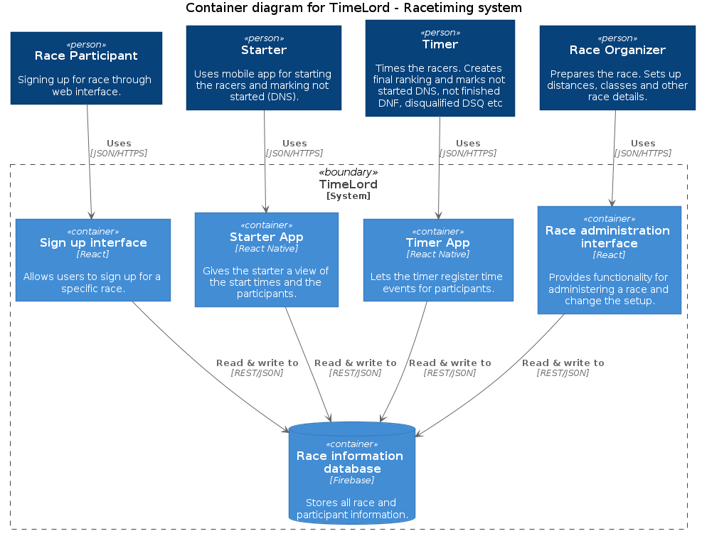

# STime - Simple Race Timing System

The system consists of the following parts:
 * Sign-up interface
 * Stater App
 * Timer App
 * Race admin interface

 The backend is using Firebase

 Here is a container diagram for the solution:
 
